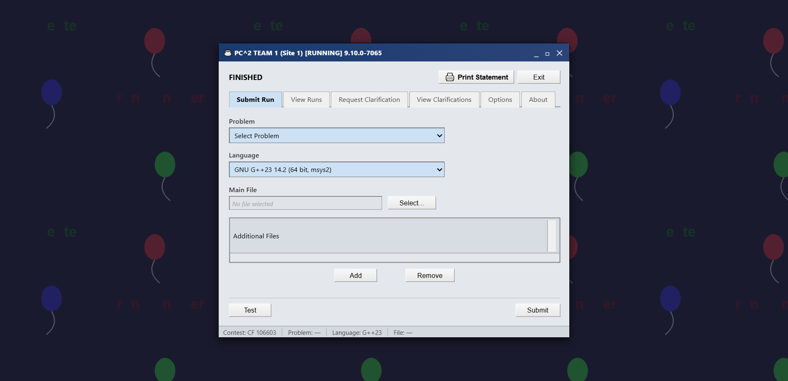
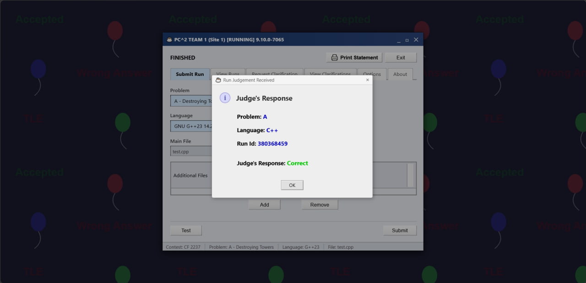
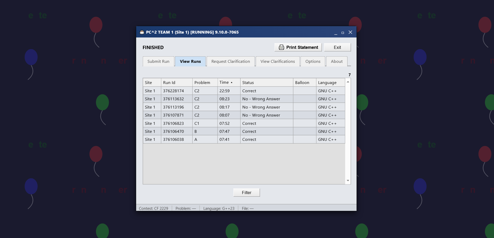
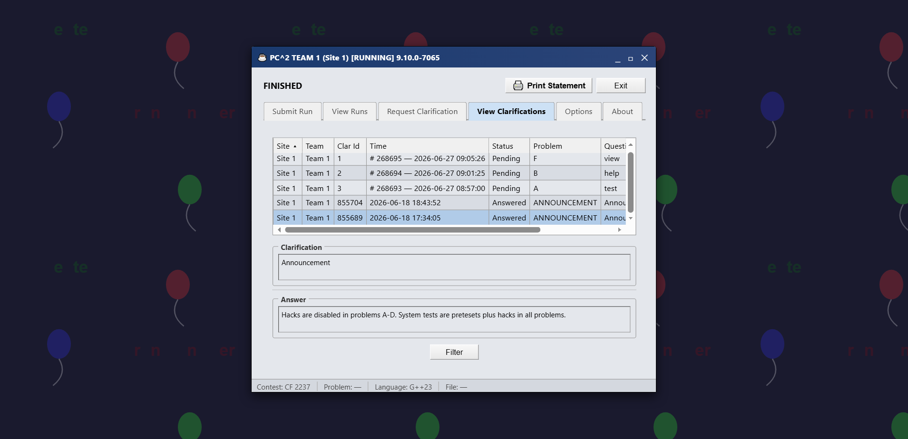
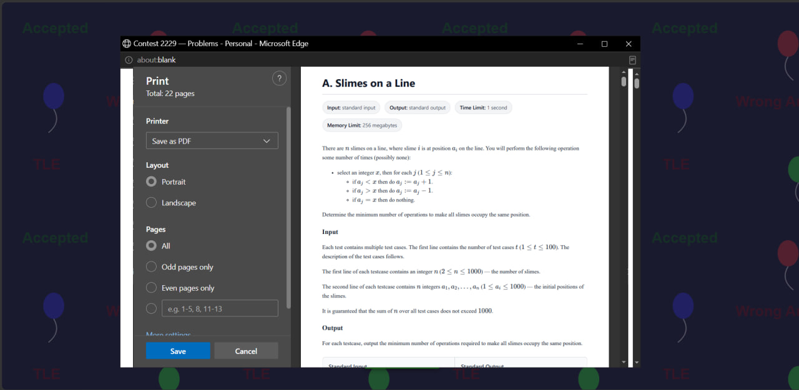

  <h1>🏆 Codeforces to PC² Emulator</h1>
  
<strong>Transform your Codeforces dashboard into the classic PC² (Programming Contest Control System) interface.</strong>

  
  
  
  

 

Bring back the nostalgia of classic competitive programming! This browser extension perfectly recreates the legendary **PC² environment** directly on top of Codeforces contests. Experience the thrill of real-time draggable popups, raw run tables, and dedicated problem PDF generation.

---

## ✨ Features

- 🖥️ **Authentic PC² Interface**: Flawlessly overrides the standard Codeforces dashboard with a retro-style PC² GUI.
- 🚀 **Direct Submissions**: Submit your source code directly through the PC² client window without navigating Codeforces forms.
- 🔔 **Live Verdict Popups**: Receive real-time, draggable verdict alerts (e.g., `Accepted`, `Wrong Answer`) exactly as they arrive from the judge.
- 📜 **View Runs Tab**: Monitor your submission history in the classic tabular format.
- 💬 **View Clarifications**: Read contest announcements and problem clarifications in the authentic PC² message log format.
- 🖨️ **PDF Generation**: Export all contest problems into a clean, distraction-free, math-rendered PDF ready for printing.
- ⏱️ **Countdown & Lockout**: Syncs perfectly with Codeforces timers. Submissions are locked before the contest begins and automatically unlock at `00:00:00`.
- 🔐 **Smart Auth & Cloudflare Bypass**: Handles Codeforces logins and seamlessly navigates Cloudflare security challenges.
- 🧠 **Context-Aware**: Activates only on contest dashboards. It stands down on problem description and standings pages so you can browse naturally.

---

## 📸 Screenshots

*(Place your screenshots in an `assets/` folder in the repository root)*

### 1. Main PC² Submit Interface

*The legendary Submit Run tab replacing the Codeforces dashboard.*

### 2. Real-time Verdict Popup

*Draggable, real-time popups alerting you of your run status.*

### 3. View Runs History

*Keep track of your submissions directly within the client.*

### 4. View Clarifications

*Stay updated with contest announcements and clarifications in the PC² message format.*

### 5. Clean PDF Export

*Generate clean, printable problem sets without browser headers.*

---

## 🛠️ How to Install

### Chromium-based Browsers (Chrome, Edge, Brave, etc.)
1. **Download** or clone this repository to your local machine.
2. Navigate to your browser's extensions page:
   - Chrome: `chrome://extensions/`
   - Edge: `edge://extensions/`
   - Brave: `brave://extensions/`
3. Toggle **Developer mode** on (usually top right or bottom left).
4. Click **Load unpacked**.
5. Select the folder containing the `manifest.json` file.
6. Done! 🎉 Navigate to a Codeforces contest to see it in action.

### Mozilla Firefox
1. **Download** or clone this repository to your local machine.
2. Navigate to `about:debugging#/runtime/this-firefox`.
3. Click **Load Temporary Add-on...**.
4. Select the `manifest.json` file inside the repository folder.
5. Done! 🎉 *(Note: Firefox removes temporary add-ons when closed).*

---

## 🚀 How to Use

1. **Enter a Contest**: Go to any active or upcoming Codeforces contest dashboard (e.g., `https://codeforces.com/contest/2237`). The PC² interface will automatically launch.
2. **Read Problems**: Click on a problem letter or navigate to a problem URL (`/problem/A`). The extension steps aside so you can read standard Codeforces descriptions.
3. **Submit Code**: Under the `Submit Run` tab, select the problem, your language, choose your code file, and hit **Submit**.
4. **Export Problems**: Click the "Print Problems" button to generate a clean, static PDF of all problems.
5. **Check History**: Use the `View Runs` tab to see all your contest submissions at a glance.
6. **Read Clarifications**: Switch to the `View Clarifications` tab to read all important announcements from the judges.

---

  Developed with 💻 and ☕ by <strong>Abdo Sleem</strong>

